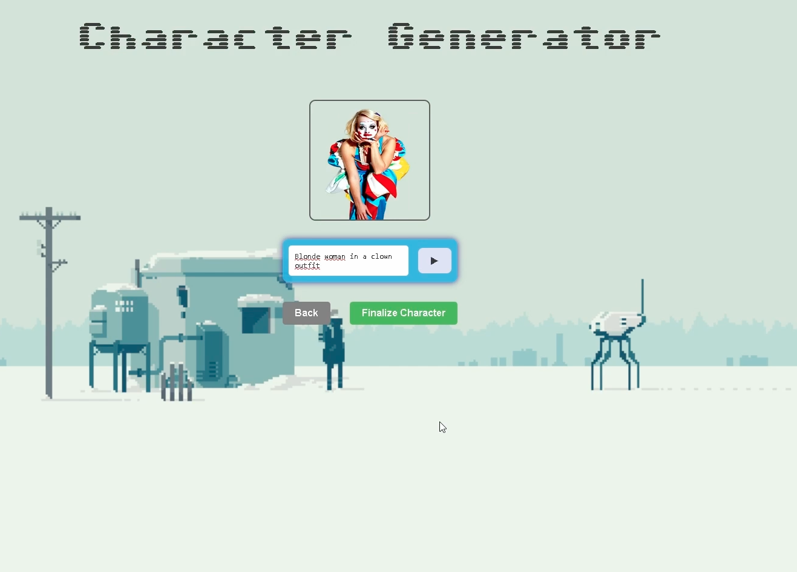

# Texture 

## Overview

Texture Adventure is an interactive web-based game developed during the ByBorg Hackathon 2025 in just 24 hours. The game combines visual puzzles with conversational AI to create an engaging educational experience.

## Game Concept

In Texture Adventure:
- A partially hidden image is presented to the player
- An AI chatbot asks "Twister-like" questions about the hidden object
- Players must guess what's hidden based on the visible portions and clues
- Correct guesses reveal more of the image
- The game continues until the entire scene is unveiled

## Motivation

Texture Adventure was created with several goals in mind:
- **Scene Understanding**: Improve players' ability to recognize and understand visual scenes with limited information
- **Educational Value**: Teach players about objects, their properties, and relationships in a fun, interactive way

## Demo

[](./media/thumbnails/Texture-demo.mov)

[download the demo video directly](./media/thumbnails/Texture-demo.mov).

## Technologies Used

- **Frontend**: React.js, HTML5, CSS3
- **Backend**: Django
- **Image and Text Processing**: Qwen2.5-32B-Instruct and YoloWorld with SAM

## Installation

```bash
# Clone the repository
git clone git@github.com:tamastheactual/Texture---ByBorg-Hackaton.git

# Install dependencies
npm install

# Start the development server
npm start
```

## How to Play

1. Open the game in your web browser 
2. First describe your avatar and it will create a fully controllable avatar for you
3. Observe the partially hidden image on the left side
4. Read the chatbot's question about the hidden object
5. Type your guess in the chat interface
6. If correct, more of the image will be revealed
7. Continue guessing until the entire scene is unveiled

**Technical Note:** The game requires LLM (Large Language Model) and SAM (Segment Anything Model) running in the background to function properly. Ensure these services are running before starting the game.

## Team

Texture was created by Press F to Backprop during the ByBorg Hackathon 2025.

### Contributors

- [Szasz Milan](https://github.com/szaszmilan)
- [Csibi Zsolt](https://github.com/zsolt-csibi)
- [Molnar Imre](https://github.com/PercibalBuxus)
- [Takacs Tamas](https://github.com/tamastheactual)


Special thanks to all team members for their hard work and dedication to this project.

## License

This project is licensed under the MIT License - see the [LICENSE](LICENSE) file for details.

## Acknowledgments

Special thanks to the organizers of the ByBorg Hackathon 2025 for providing the opportunity to create this project.

## Additional Resources

For more information about the project, you can check our [presentation slides](./media/texture.pptx).
